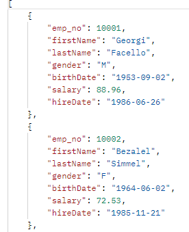
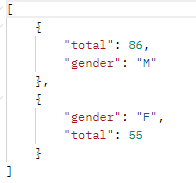
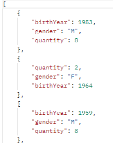
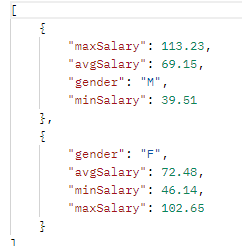

## README

# coodesh/digiage-challenge-20240402
> This is a challenge by [Coodesh](https://coodesh.com/)

Desafio para habilidades como Back-end da coodesh :)

## Tecnologias Utilizadas
- Java 1.6
- Spring
- Lombok
- JPA
- H2
- AWS S3
- REST
- POSTMAN

## Como rodar as task
- task1 até task4 - rodar a aplicação java  
- task5 - subir uma aplicação spring boot app

### TASK5
- task 5 tem dois perfis

-- test:
1. roda com banco de dados H2, com banco de dados populados de acordo com o arquivo import.sql;
2. é possível adicionar e remover employee da tabela;
3. caminhos:
- get    /employees - retorna todos os employees
- get    /employees/countEmployeesByGender - retorna quantidade de funcionários por sexo
- get    /employees/getBirthYearStatisticsByGender - retorna quantidade de funcionários por sexo de acordo com o ano que nasceu
- get    /employees/getStatisticsByGender - retorna a média, max e min salário por sexo
- post   /employees - adciona um funcionário, passando no body
- delete /employees/id - deleta um funcionário pelo id

--dev
1. roda no banco de dados informado no test;
2. foi usada a tabela: result_test_guilherme, pois era a que tinha todas as informações do teste, e também não consegui criar uma tabela no bd;
3. os caminhos são os mesmos, porém deve trocar o /employees por /employees2

**ver figuras

## Figuras
- get    /employees2

- get /employees2/countEmployeesByGender

- get /employees2/getBirthYearStatisticsByGender

- get /employees2/getStatisticsByGender

